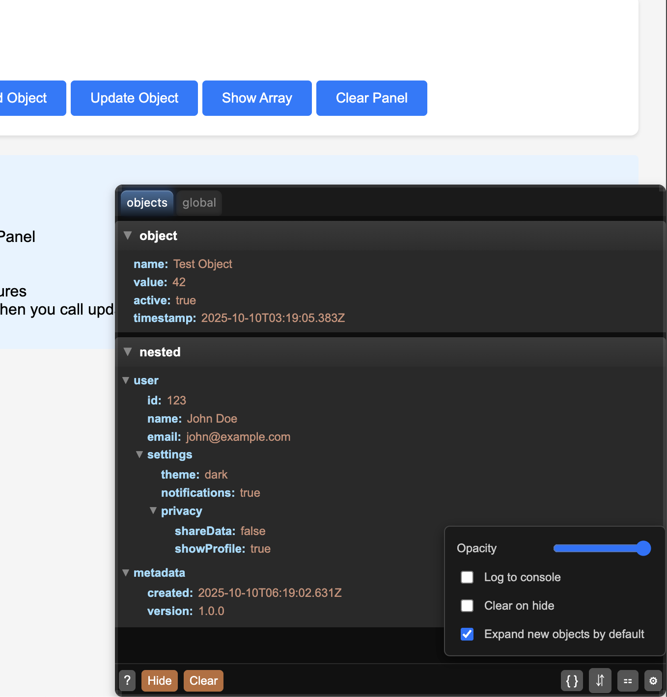

# Debug Panel Logger

A draggable, resizable debug panel for logging and state inspection in web applications.

Renders log statements or object state to the panel in a tabbed view, utilizing json diffing to only updated changed properties so that it remains efficient. Clear or copy log outputs easily, and see large JSON object state in one place.

This panel can be moved and resized to any position, snaps to window edges, and its state will be preserved across page loads. Ctrl+Alt+D toggles visibility.



## Features

- 🎯 **Draggable & Resizable** - Position and size the panel to fit your workflow
- 📊 **State Inspection** - View and track object states with JSON tree visualization
- 📝 **Multi-tab Logging** - Organize logs by namespace/category
- 🎨 **Auto-injected Styles** - SCSS styles are bundled and injected automatically
- 🚀 **Framework Agnostic** - Works with any web framework or vanilla JS
- 📦 **TypeScript Support** - Full type definitions included

## Installation

```bash
npm install debug-panel-logger
# or
yarn add debug-panel-logger
```

## Quick Start

### Basic Usage (Vanilla JS/TS)

```javascript
import { DebugPanel, debugState } from 'debug-panel-logger';

// Create and show the debug panel
const panel = new DebugPanel({
  position: 'bottomRight' // or ScreenPosition.BottomRight
});

// Log state from anywhere in your app
debugState('user', { id: 1, name: 'John', active: true });
debugState('config', { theme: 'dark', api: 'https://api.example.com' });

// Add regular logs
panel.addLog('api', ['Fetching user data...']);
panel.addLog('ui', ['Button clicked', { buttonId: 'submit' }]);
```

### Example: Integration with Logging Framework
Register a custom LogModule with the get-loggers system, so it will automatically receive app-wide log events and render them to the panel.

```javascript
import { DebugPanelLogModule } from 'debug-panel-logger';
import { addLogModule } from 'get-loggers'; // or your logging framework

// Create log module and add to your logging system
const debugModule = new DebugPanelLogModule({
  position: 'bottomRight',
  width: 600,
  height: 400
});

addLogModule(debugModule);

// Now all logs will appear in the debug panel
```

### Example: React Integration

```tsx
import { DebugPanel, debugState } from 'debug-panel-logger';
import { useEffect, useRef } from 'react';

function App() {
  const panelRef = useRef<DebugPanel>();

  useEffect(() => {
    // Initialize panel
    panelRef.current = new DebugPanel({ show: true });

    // Cleanup on unmount
    return () => {
      panelRef.current?.hide();
    };
  }, []);

  const handleStateUpdate = () => {
    debugState('component-state', {
      timestamp: Date.now(),
      userCount: 42,
      features: ['dark-mode', 'auto-save']
    });
  };

  return (
    <div>
      <button onClick={handleStateUpdate}>Update Debug State</button>
      {/* Your app content */}
    </div>
  );
}
```

## API Reference

### DebugPanel

Main class for creating and managing the debug panel.

```typescript
import { DebugPanel, ScreenPosition } from 'debug-panel-logger';

const panel = new DebugPanel({
  show?: boolean;          // Show panel immediately (default: false)
  position?: ScreenPosition; // Initial position (default: 'bottomRight')
  width?: number;          // Initial width in pixels (default: 600)
  height?: number;         // Initial height in pixels (default: 400)
  snap?: boolean;          // Enable edge snapping when dragging (default: false)
  snapPadding?: number;    // Snap distance in pixels (default: 20)
});

// Methods
panel.show();           // Show the panel
panel.hide();           // Hide the panel
panel.toggle();         // Toggle visibility
panel.addLog(namespace, message);    // Add log entry
panel.debugState(id, state);        // Update state view
```

### ScreenPosition

Available positions for the debug panel:

```typescript
enum ScreenPosition {
  TopLeft = 'topLeft',
  Top = 'top',
  TopRight = 'topRight',
  Right = 'right',
  BottomRight = 'bottomRight',
  Bottom = 'bottom',
  BottomLeft = 'bottomLeft',
  Left = 'left'
}
```

### debugState Function

Utility function to send state updates to the debug panel from anywhere:

```typescript
import { debugState } from 'debug-panel-logger';

debugState('unique-id', anyObject);
```

### JsonView

Standalone JSON tree viewer componen. This is used by the DebugPanel internally, but can be used by itself (it will be moved to a separate library soon).

It is efficient: Any calls to updateJson will update the given data using jsondiffpatch, only redrawing the properties that have changes (it uses a "mini" virtual dom).

```typescript
import { JsonView } from 'debug-panel-logger';

const jsonView = new JsonView(data, containerElement, {
  expandAll?: boolean;              	// Expand all nodes initially
  expandObjs?: Array<string | RegExp>;  // Patterns for auto-expanded paths
  useViewState?: boolean;           	// Remember expand/collapse state
});

jsonView.updateJson(newData);       	// Update via diffing with new data
```

## Keyboard Shortcuts

- **Ctrl+Alt+D** - Toggle debug panel visibility

## Features in Detail

### State Inspection
- View complex objects in an expandable JSON tree
- Real-time updates when state changes
- Collapsible sections with memory of view state
- Syntax highlighting for better readability

### Multi-tab Logging
- Automatic namespace-based tab creation
- Global tab shows all logs combined
- Per-tab clearing functionality
- Copy individual log entries

### Panel Interaction
- Drag to reposition anywhere on screen
- Resize from any edge or corner
- Adjustable opacity slider
- Persistent settings saved to localStorage
- Responsive layout for narrow panels

## Browser Support

- Chrome/Edge 88+
- Firefox 85+
- Safari 14+

## TypeScript

Full TypeScript support with exported types:

```typescript
import type {
  DebugPanelOptions,
  DebugPanelSettings,
  JsonViewOptions,
  ResizeOptions,
  DragOptions
} from 'debug-panel-logger';
```

## License

ISC